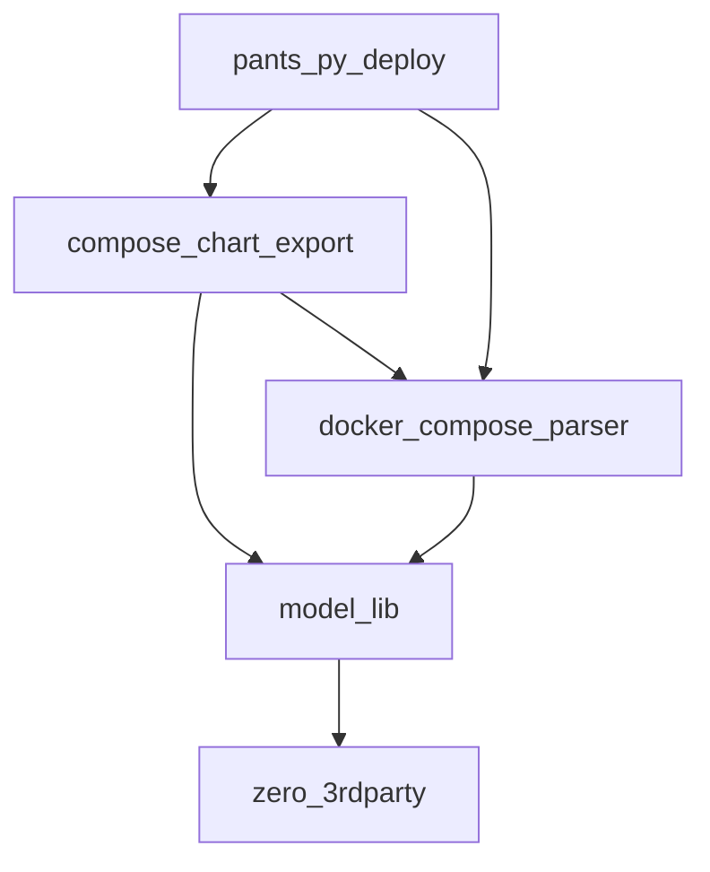

<p align="center">
    <a href="https://github.com/EspenAlbert/py-libs/actions/workflows/ci.yaml" target="_blank">
        
    </a>
    <a href="https://pypi.org/project/model-lib/" target="_blank">
        
    </a>
    <a href="https://pypi.org/project/model-lib/" target="_blank">
        
    </a>
    <a href="https://codecov.io/gh/EspenAlbert/py-libs" target="_blank">
        
    </a>
    <a href="https://github.com/psf/black" target="_blank">
            
    </a>
    <a href="https://github.com/EspenAlbert/py-libs/blob/main/LICENSE" target="_blank">
            
    </a>
    <a href="https://github.com/pre-commit/pre-commit"></a>

</p>

# py-libs (drastic changes coming for v1.0.0)

- An experiment for sharing python packages
- ~~[compose_chart_export](./compose_chart_export/readme.md)~~
	- `pip install compose-chart-export`
- ~~[docker_compose_parser](./docker_compose_parser/readme.md)~~
	- `pip install docker-compose-parser`
- [model_lib-pydantic base models with convenient dump methods](./model-lib/readme.md)
	- `pip install model-lib`
- [zero_lib-handy standalone scripts without 3rdparty dependencies](./zero-3rdparty/readme.md)
	- `pip install zero-3rdparty`

## Hierarchy



- (Click) on a library to see the documentation
- The higher up in the hierarchy the more dependencies needs to be installed
	- e.g., `zero_3rdparty` has no dependencies and `pants_py_deploy` depends on all the others

## Local Installation

- [Install `just`](https://just.systems/man/en/introduction.html)
- [Install `uv`](https://docs.astral.sh/uv/getting-started/installation/)

```sh
pre-commit install --hook-type pre-push
uv sync
code .
```

## Release process
1. Do changes on your branch
2. Bump the versions you want to deploy
```sh
just pkg-version z beta # alpha/patch,etc.
just pkg-version m beta
```
3. Merge and wait for release to complete

