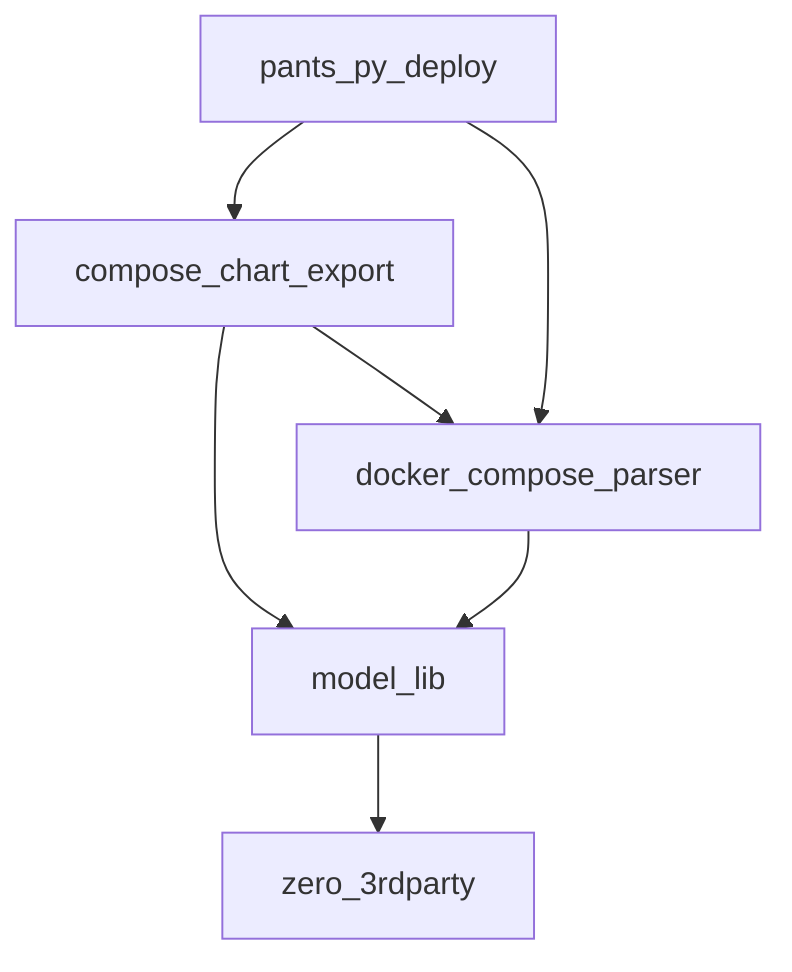

<p align="center">
    <a href="https://github.com/EspenAlbert/py-libs/actions/workflows/ci.yaml" target="_blank">
        
    </a>
    <a href="https://pypi.org/project/model-lib/" target="_blank">
        
    </a>
    <a href="https://pypi.org/project/model-lib/" target="_blank">
        
    </a>
    <a href="https://codecov.io/gh/EspenAlbert/py-libs" target="_blank">
        
    </a>
    <a href="https://github.com/psf/black" target="_blank">
            
    </a>
    <a href="https://github.com/EspenAlbert/py-libs/blob/main/LICENSE" target="_blank">
            
    </a>
    <a href="https://github.com/pre-commit/pre-commit"></a>

</p>

# py-libs

- An experiment for sharing python packages
- [compose_chart_export](./compose_chart_export/readme.md)
	- `pip install compose-chart-export`
- [docker_compose_parser](./docker_compose_parser/readme.md)
	- `pip install docker-compose-parser`
- [model_lib-pydantic base models with convenient dump methods](./model_lib/readme.md)
	- `pip install model-lib`
- [zero_lib-handy standalone scripts without 3rdparty dependencies](./zero_3rdparty/readme.md)
	- `pip install zero-3rdparty`

## Hierarchy



- (Click) on a library to see the documentation
- The higher up in the hierarchy the more dependencies needs to be installed
	- e.g., `zero_3rdparty` has no dependencies and `pants_py_deploy` depends on all the others

## Local Installation

- [Install pants](https://www.pantsbuild.org/v2.17/docs/installation)
	- `brew install pantsbuild/tap/pants`

```shell
export PANTS_PYTHON_RESOLVES_TO_INTERPRETER_CONSTRAINTS="{'python-default': ['==3.10.*']}" # choose the version of python you like
pants export --export-resolve=python-default
# import the venv to pycharm/vs code, e.g., dist/export/python/virtualenvs/python-default/3.10.12
```
